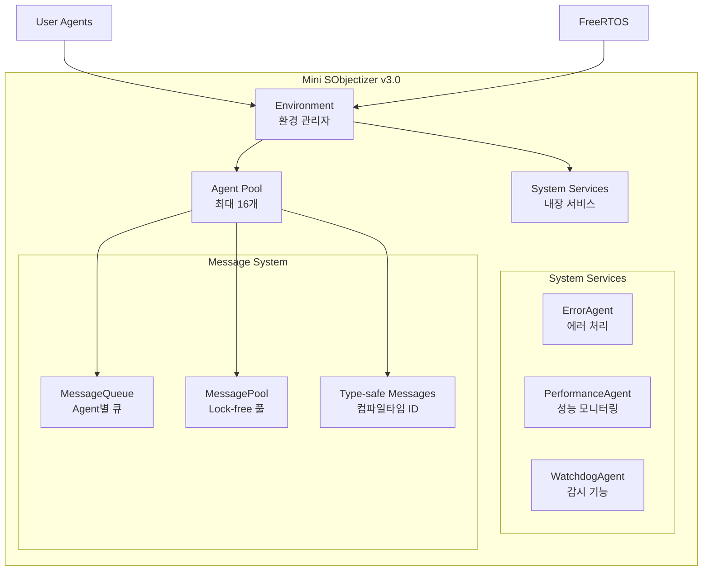

# 🚀 Getting Started with Mini SObjectizer v3.0

Mini SObjectizer는 임베디드 시스템을 위한 production-ready Actor Model 프레임워크입니다.

## 📋 Quick Start

### 1. 기본 요구사항

- **C++17** 이상 지원 컴파일러
- **CMake 3.15+** 또는 **PlatformIO**
- **FreeRTOS** (임베디드 환경) 또는 **Host 환경** (테스트용)

### 2. 간단한 예제 (User-Friendly Macros!)

```cpp
#include "mini_sobjectizer/mini_sobjectizer.h"
using namespace mini_so;

// 메시지 정의
struct TemperatureData {
    float celsius;
    uint32_t sensor_id;
};

// Agent 정의 (새로운 user-friendly 방식!)
class TemperatureSensor : public Agent {
public:
    bool handle_message(const MessageBase& msg) noexcept override {
        HANDLE_MESSAGE_VOID(TemperatureData, process_temperature);
        return false;
    }
    
private:
    void process_temperature(const TemperatureData& data) {
        printf("Temperature: %.1f°C from sensor %u\n", 
               data.celsius, data.sensor_id);
        MINI_SO_HEARTBEAT();  // 간편한 heartbeat
    }
};

int main() {
    // 시스템 초기화 (한 줄로!)
    MINI_SO_INIT();
    
    // Agent 등록 (간편하게!)
    TemperatureSensor sensor;
    AgentId sensor_id = MINI_SO_REGISTER(sensor);
    
    // 메시지 전송
    TemperatureData data{23.5f, 1};
    env.send_message(sensor_id, sensor_id, data);
    
    // 메시지 처리 (간편하게!)
    MINI_SO_PROCESS_ALL();
    
    return 0;
}
```

### 3. 전통적 방식 vs User-Friendly 방식

| 기능 | 전통적 방식 | User-Friendly 방식 |
|------|-------------|-------------------|
| **메시지 핸들링** | 5줄의 반복 코드 | `HANDLE_MESSAGE(Type, handler)` |
| **시스템 초기화** | 3줄의 boilerplate | `MINI_SO_INIT()` |
| **Agent 등록** | `env.register_agent(&agent)` | `MINI_SO_REGISTER(agent)` |
| **메시지 브로드캐스트** | `broadcast_message(data)` | `MINI_SO_BROADCAST(data)` |
| **Heartbeat** | `System::instance().heartbeat(id())` | `MINI_SO_HEARTBEAT()` |
| **타입 ID 생성** | `MESSAGE_TYPE_ID(T)` | `MSG_ID(T)` |

### 4. 빌드 방법

#### CMake 빌드
```bash
mkdir build && cd build
cmake .. -DCMAKE_BUILD_TYPE=Release
make -j4
```

#### PlatformIO 빌드 (임베디드)
```bash
pio run -e esp32        # ESP32용
pio run -e stm32f103rc  # STM32용
pio run -e native_test  # Host 테스트용
```

## 🏗️ 아키텍처 개요



## 🎯 핵심 특징

### ⚡ Zero-overhead Performance
- 8바이트 최적화된 메시지 헤더
- 컴파일타임 타입 ID 생성
- 캐시 정렬 데이터 구조

### 🛡️ Production-ready Reliability
- 메모리 안전성 보장
- Lock-free 동시성 지원
- Emergency fail-safe 메커니즘

### 🔄 Pure Actor Model
- 100% 메시지 기반 통신
- Agent 간 상태 공유 없음
- 타입 안전 메시지 디스패치

## 📊 성능 지표

| 메트릭 | 값 | 목표 |
|--------|-----|------|
| 코드 크기 | 4.8KB | < 10KB ✅ |
| 메시지 처리량 | 2,200+ msg/sec | > 1,000 ✅ |
| 메모리 사용량 | 16 bytes BSS | < 1KB ✅ |
| 타이밍 정밀도 | 마이크로초 | < 1ms ✅ |

## 🔍 다음 단계

1. **[Architecture Guide](ARCHITECTURE.md)** - 상세 아키텍처 이해
2. **[API Reference](API_REFERENCE.md)** - 전체 API 문서
3. **[Examples](../examples/)** - 실제 사용 예제들
4. **[Testing Guide](TESTING.md)** - 테스트 방법 안내

## 💡 도움말

- 질문이나 이슈가 있으면 GitHub Issues를 활용하세요
- [CLAUDE.md](../CLAUDE.md)에서 개발 가이드라인을 확인하세요
- Production 환경 적용 전에 [Testing Guide](TESTING.md)를 따라 검증하세요